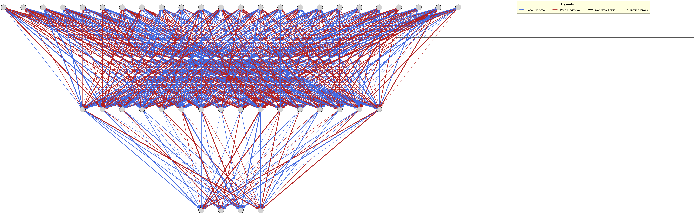

# Jogo da Cobrinha com Inteligência Artificial


Este projeto é uma implementação do jogo da cobrinha + uma rede neural que aprende a jogar com algoritmos genéticos.

Para maiores detalhes sobre a implementação da rede neural, visite [https://github.com/Largyrixa/RedeNeural.git](https://github.com/Largyrixa/RedeNeural.git)

### Treinar a IA

`./build/bin/treinar` ou `build\bin\treinar.exe`

Durante a execução, a cada geração, o melhor bot jogará uma rodada

| Argumento | Descrição                            | Valor Padrão | Valor Mínimo | Valor Máximo |
| :-------: | :-----------------------------------: | :----------: | :----------: | :----------: |
| `-c`      | Flag para carregar uma rede neural descrita em `data` em toda a população | - | - | - |
| `-tm`     | Taxa de mutação **(entre 0 e 1)** a ser utilizada no treinamento | 0.015 | 0 | 1 |
| `-tp`     | Tamanho da população a ser utilzada no treinamento | 10000 | 10 | - |
| `-sp`     | Caminho para salvar/carregar a rede neural | `data/melhor_cerebro.txt` | - | - |

**Visualizar a Rede:**

- Caso queira visualizar a rede neural gerada, utilize o programa `gerar_mapa.py` em `scripts`

**Dependências:**
- Certifique-se de ter o [Python 3](https://www.python.org/downloads/) e o [graphviz](https://graphviz.org/) instalados:

**Uso:**

```bash
# Verificar a instalação do python
python3 --version

# Criar um ambiente virtual para o python
python3 -m .venv

# Entrar no ambiente virtual
source .venv/bin/activate

# Instalar dependências
pip install graphviz

# Rodar o programa
python3 scripts/gerar_mapa.py
```
O script irá ler o arquivo em `data/melhor_cerebro.txt` e gerar a imagem `mapa_neural.png` na pasta `images`


exemplo de visualização da rede


### Bot
`./build/bin/bot_play` ou `build\bin\bot_play.exe`

Por padrão, o bot irá carregar o cérebro em `data/melhor_cerebro.txt`,
caso queira utilizar um arquivo diferente, passe o caminho como argumento

**Exemplo**
```bash
./build/bin/bot_play data/outro_cerebro.txt
```

### Jogar
`./build/bin/play` ou `build\bin\play.exe`

### Como Compilar

Certifique-se de ter um compilador C++, o CMake e a biblioteca [ncurses](https://terminalroot.com.br/ncurses) instalados

```bash
# Clone o repositorio
git clone https://github.com/Largyrixa/SnakeAI.git
cd SnakeAI

# Crie a pasta de build e compile
mkdir build
cd build
cmake ..
make
```
Os executáveis estarão na pasta `build/bin`
